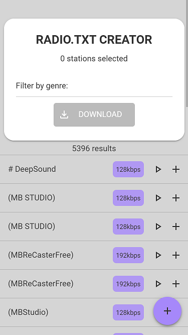
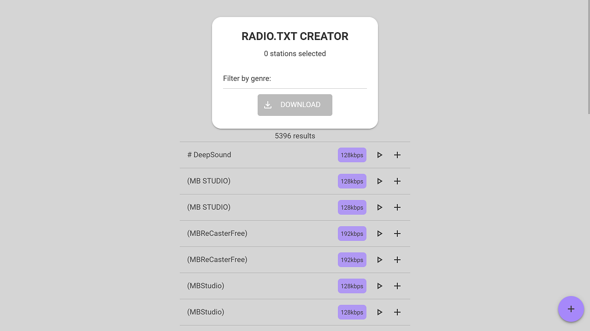

# customradio V:1.12.1

An online radio station browser with the ability to export a radio.txt file for use in Hiby digital audio players.

> Sourcecode for <https://customradio.dough10.me>

Hosts a database of [Icecast](https://icecast.org/) stations so users can listen and add them to a custom list. Users can download the list in .txt format for use in a [Hiby](https://store.hiby.com/) digital audio player.

## Environment Variables

- **LOG_LEVEL** = *console and file log level: Defaults to INFO*

### NPM Dependencies

- **axios**: *1.7.4*
- **compression**: *1.7.4*
- **connect-redis**: *8.0.3*
- **cors**: *2.8.5*
- **dotenv**: *16.4.5*
- **express**: *4.19.2*
- **express-session**: *1.18.1*
- **express-validator**: *7.1.0*
- **he**: *1.2.0*
- **helmet**: *8.0.0*
- **multer**: *1.4.5-lts.1*
- **node-schedule**: *2.1.1*
- **prom-client**: *15.1.3*
- **pug**: *3.0.3*
- **redis**: *5.0.0*
- **sqlite3**: *5.1.7*
- **xml2js**: *0.6.2*

### NPM Dev Dependencies

- **@babel/core**: *7.24.9*
- **@babel/preset-env**: *7.24.8*
- **@open-wc/testing**: *4.0.0*
- **@web/test-runner**: *0.18.3*
- **@web/test-runner-playwright**: *0.11.0*
- **@webpack-cli/generators**: *3.0.7*
- **axios-mock-adapter**: *2.0.0*
- **babel-loader**: *9.1.3*
- **chai**: *5.1.1*
- **clean-webpack-plugin**: *4.0.0*
- **copy-webpack-plugin**: *12.0.2*
- **css-loader**: *7.1.2*
- **css-minimizer-webpack-plugin**: *7.0.0*
- **jsdoc-to-markdown**: *8.0.3*
- **jshint**: *2.13.6*
- **mini-css-extract-plugin**: *2.9.0*
- **mocha**: *10.7.3*
- **mongodb**: *6.15.0*
- **sinon**: *19.0.4*
- **terser-webpack-plugin**: *5.3.10*
- **version-incrementer**: *0.1.1*
- **webpack**: *5.93.0*
- **webpack-cli**: *5.1.4*
- **webpack-merge**: *6.0.1*

### contact me

<admin@dough10.me>
